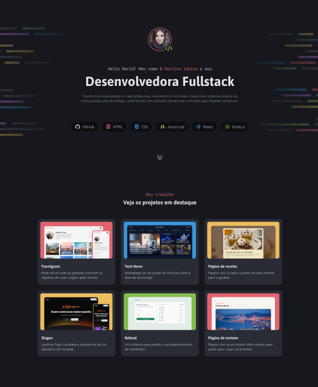

<h1 align="center"> Portfolio Dev </h1>

 projeto e um site desktop de portfolio para desenlvedores, com links para projetos e contato porfissional 

  <a href="#-tecnologias">Tecnologias</a>&nbsp;&nbsp;&nbsp;|&nbsp;&nbsp;&nbsp;
  <a href="#-projeto">Projeto</a>&nbsp;&nbsp;&nbsp;|&nbsp;&nbsp;&nbsp;
  <a href="#-layout">Layout</a>&nbsp;&nbsp;&nbsp;|&nbsp;&nbsp;&nbsp;
  <a href="#memo-licença">Licença</a>

  

 

## 🚀 Tecnologias

Esse projeto foi desenvolvido com as seguintes tecnologias:

- HTML e CSS
- Git e Github
- Figma

  ## 💻 Projeto

Esse projeto eu desenvolvi a Landing Page de marketing completa e responsiva de um aplicativo de Karaokê chamado Zingen.
Esse é um dos desafios daformação Full-stack, um dos conteúdos disponiveis para alunos da ROcketseat.

## 🔖 Layout

Você pode visualizar o layout do projeto através [DESSE LINK](figma.com/design/AJy1iHTg2GwDtR4n7lyy53/Portfolio-Dev--Community-?t=6W3OkUVBbkWa0nUS-0). É necessário ter conta no [Figma](https://figma.com) para acessá-lo.

## 📝 Licença

Esse projeto está sob a licença MIT.

---

Feito com ♥ by Rocketseat 👋 Participe da nossa comunidade!
